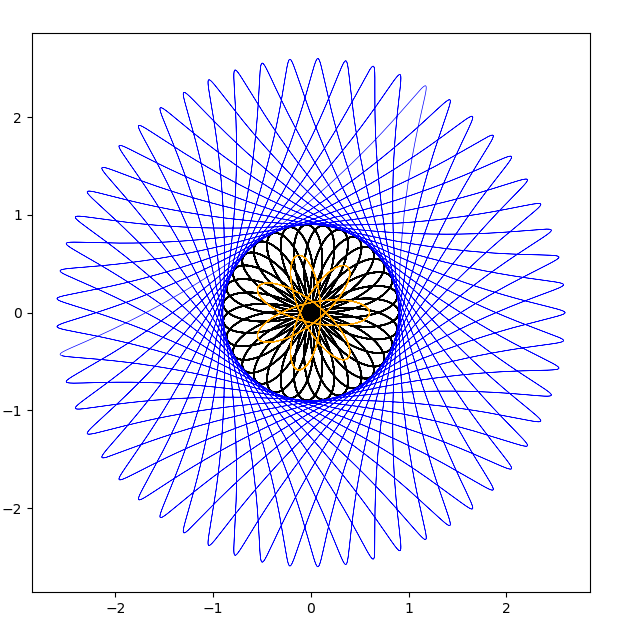

# Complex Fourier
Allows the creation of visualization using complex Fouriers given by one one more components.

Also a special case of this known as "spirograph" can easily be configured and.

## Install
### Create a conda environment
```bash
conda init bash # => Open new terminal
conda create --name complex_fourier python=3.7
conda install --name complex_fourier matplotlib
```

### Activate the conda environment and start the program
```bash
cd complex_fourier/
conda activate complex_fourier
python complex_fourier.py
```

Here's a screenshot on what is possible:



## Additional information
The complex_fourier_mandelbrot is just a copy of another author's code as a possible inspiration.
